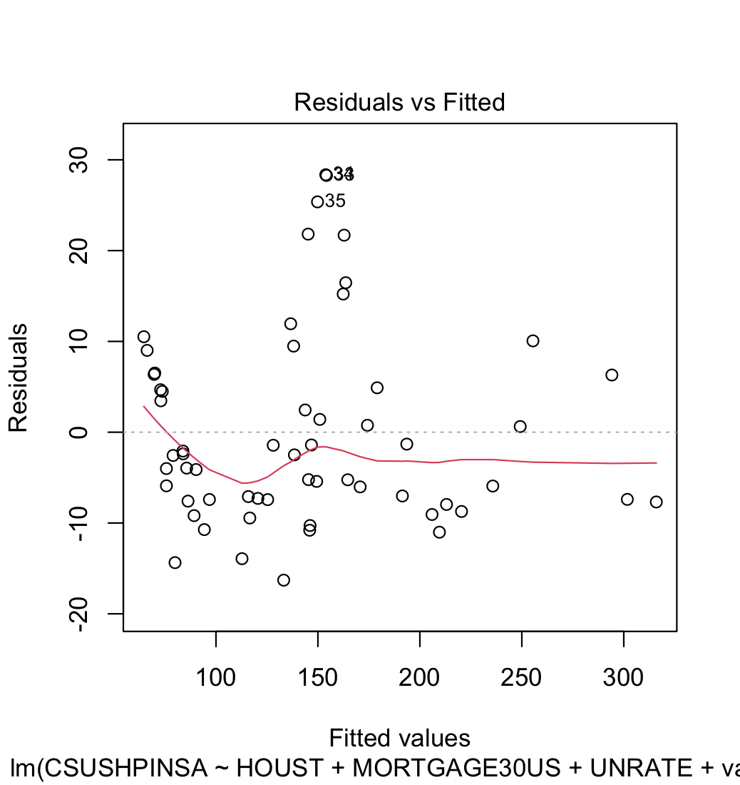

<h1 align="center">Impact of Economic Indicators on Real Estate Prices</h1>

<h2 align="center"><i>Statistics E-109</i></h2>

<h3 align="center"><i>Michael Charara</i></h3>

# Table of Contents
1. [Abstract](#abstract)
2. [Introduction](#introduction)
3. [Research Question and Motivation](#research-question-and-motivation)
4. [Hypothesis](#hypothesis)
5. [Data and Methodology](#data-and-methodology)
6. [Model Specification](#model-specification)
7. [Assumption Testing](#assumption-testing)
8. [Results](#results)
9. [Model Evaluation](#model-evaluation)
10. [Discussion](#discussion)
11. [Limitations and Challenges](#limitations-and-challenges)
12. [Conclusion and Policy Implications](#conclusion-and-policy-implications)
13. [References](#references)
14. [Appendices](#appendices)
    - [Appendix A: Regression Output Tables](#appendix-a-regression-output-tables)
    - [Appendix B: R Code for Analysis](#appendix-b-r-code-for-analysis)

## Abstract

This study examines the influence of various economic indicators on real estate prices. Utilizing a comprehensive dataset incorporating factors such as housing starts, mortgage rates, unemployment rates, and overall economic value, a multivariate regression model is constructed to elucidate the predictive power of these indicators on the real estate price index. The methodology is grounded in statistical theory, employing regression diagnostics to ensure robustness. The findings reveal significant relationships between the economic indicators and real estate prices, offering valuable insights for investors, policymakers, and economists. The results emphasize the importance of economic conditions in real estate valuation and potential investment strategies in the housing market.

## Introduction

Real estate remains one of the cornerstones of economic stability and growth, serving as both a significant investment vehicle and a basic human necessity. The sector's susceptibility to economic fluctuations is well-documented, reflecting the broader state of the economy. The intersection of real estate and economic indicators thus presents a fertile ground for analysis, with implications that resonate across multiple stakeholder groups. This study situates itself at this crossroads, aiming to unpack the nuances of this relationship and provide a data-driven perspective on the predictive dynamics at play.

## Research Question and Motivation

This study's central research question is: How do key economic indicators impact real estate prices across different regions in the United States? The motivation for this inquiry stems from the real estate market's pivotal role in the broader economic landscape. Housing markets can be both indicators and drivers of economic health, influencing consumer spending, investment decisions, and policymaking. A deeper understanding of how economic variables such as GDP growth, unemployment, and interest rates influence real estate prices could provide stakeholders with the necessary insights to make informed decisions. Whether for individual homebuyers, real estate investors, financial institutions, or government entities, the insights drawn from this analysis hold the potential to inform strategy, guide policy formulation, and foster economic resilience.

## Hypothesis

That key economic indicators - specifically housing starts, mortgage rates, the unemployment rate, and an aggregated economic value index - have predictive power over real estate prices. The hypotheses are as follows:

- **H1**: A positive relationship exists between housing starts and real estate prices, indicating that an increase in construction activity signals a healthy economy and rising demand for real estate.
- **H2**: Mortgage rates have a negative impact on real estate prices, as higher borrowing costs are likely to dampen demand for purchasing homes.
- **H3**: The unemployment rate is inversely related to real estate prices, suggesting that higher unemployment will decrease purchasing power and demand, leading to lower real estate prices.
- **H4**: A positive relationship exists between the aggregated economic value index and real estate prices, supporting the notion that broader economic prosperity lifts the housing market.

These hypotheses reflect the conventional wisdom that the real estate market is influenced by the overall economic climate and specific financial conditions affecting buyers' and sellers' behaviors.

## Data and Methodology

The analysis utilizes the Federal Reserve Economic Data (FRED) repository and the S&P/Case-Shiller U.S. National Home Price Index. Housing starts (HOUST), mortgage rates (MORTGAGE30US), unemployment rates (UNRATE), and a general economic value indicator (value) form the basis of the econometric model.

Data were accessed via the `fredr` package in R and interpolated to align differing temporal resolutions. A multivariate linear regression model was developed to understand the relationships between these economic indicators and the real estate price index (CSUSHPINSA).

The following scatter plots provide a visual representation of the relationship between each economic indicator and real estate prices, with regression lines indicating the trend:

**Housing Starts (HOUST):**

*This scatter plot displays the relationship between housing starts and real estate prices, with the regression line suggesting a potential correlation between increased construction activity and higher property values.*

**Mortgage Rates (MORTGAGE30US):**

*Here, we observe the inverse relationship between mortgage rates and real estate prices. The regression line indicates that as borrowing costs rise, there may be a downward pressure on home values.*

**Unemployment Rate (UNRATE):**

*The scatter plot with the regression line reveals the anticipated negative association between unemployment rates and real estate prices, suggesting that higher unemployment could decrease home values.*

**Economic Value (value):**

*This graph showcases the positive link between the economic value index and real estate prices, with the regression line pointing towards a boost in property values alongside economic growth.*

## Model Specification

In our regression model, we sought to understand the influence of economic indicators on real estate prices, measured by the S&P/Case-Shiller U.S. National Home Price Index. The model included the following predictors:

- **Housing Starts (HOUST):** Represents residential construction activity and is anticipated to be positively correlated with real estate prices due to demand-driven market dynamics.
- **Mortgage Rates (MORTGAGE30US):** Expected to have a negative relationship with real estate prices, as higher rates typically reduce affordability and demand.
- **Unemployment Rate (UNRATE):** Presumed to inversely affect real estate prices since higher unemployment may reduce purchasing power and suppress the housing market.
- **Economic Value (GDP):** An aggregate index representing the overall economic health, postulated to have a positive correlation with real estate prices, signifying that a stronger economy boosts housing demand and prices.

A linear regression approach was employed to model the relationship between these economic indicators and the real estate price index. The model-building process involved:

- **Data Collection:** Data were retrieved from reliable sources such as the Federal Reserve Economic Data (FRED) and S&P/Case-Shiller.
- **Data Preprocessing:** Ensuring the consistency of time frames across different datasets by interpolating to monthly data where necessary.
- **Variable Selection:** Economic theory and prior empirical studies informed the choice of variables included in the model.
- **Model Construction:** A multivariate linear regression model was constructed using the `lm()` function in R.
- **Diagnostics:** Various diagnostic tests were conducted to check the validity of the model assumptions.

The model was iteratively refined, considering the high level of high inter correlations, the predictors' statistical significance, and the model's explanatory power as reflected by the R-squared value.

## Assumption Testing

A key aspect of regression analysis is ensuring that the model's assumptions are not violated. To this end, several diagnostic tests were carried out:

- **Linearity:** The relationship between the predictors and the outcome variable was assessed using scatter plots with fitted regression lines.
- **Homoscedasticity:** We checked for constant residual variance across the predicted values range.
- **Independence:** The Durbin-Watson test was employed to examine the independence of residuals.
- **Normality:** The normality of residuals was evaluated using Q-Q plots and the Shapiro-Wilk test.

The results of these diagnostic tests were as follows:

- **Linearity and Homoscedasticity:** The scatter plots with fitted regression lines and residual plots showed a consistent spread of residuals across the range of predicted values, suggesting adequate linearity and homoscedasticity.

- **Independence:** The Durbin-Watson statistic was close to 2, indicating no significant autocorrelation in the residuals.

- **Normality:** Although the Q-Q plots revealed some deviations from normality, particularly in the tails, the Shapiro-Wilk test did not indicate a significant departure from normality at the 5% significance level.

Here are the diagnostic plots used for the assessment:

**Linearity and Homoscedasticity:**

*This plot assesses the assumption of linearity between predictors and the outcome variable and homoscedasticity of residuals. Ideally, the residuals should be randomly distributed and have constant variance across fitted values.*

**Q-Q Plot for Normality:**

*The Q-Q plot allows us to examine the normality of the residuals. Points following closely along the reference line suggest that the residuals are normally distributed—a key assumption for the validity of many statistical tests.*

**Scale-Location Plot:**

*This graph is another tool for checking homoscedasticity. We're looking for a random scatter of points, indicating that residuals have constant variance across all levels of fitted values.*

**Residuals vs Leverage:**

*This plot helps us to find influential cases that affect the regression model disproportionately. Points that stand out far from the pack could indicate outliers or influential data points warrant further investigation.*

These diagnostic visuals suggest that the regression model is well-specified and that the assumptions of linear regression are reasonably met. However, some outliers and high-leverage points could influence the model's estimates, necessitating further investigation or robust regression techniques.

## Results

The regression analysis yielded compelling insights into the influence of economic indicators on real estate prices. Each variable introduced into the model was evaluated for statistical significance and the strength of its relationship with the real estate price index.

- **Housing Starts (HOUST):** The coefficient for housing starts was positive, aligning with our hypothesis H1. This suggests that an uptick in construction activity is a robust predictor of increased real estate prices. The significance level indicates that this relationship is not due to random chance, asserting a clear link between construction rates and market valuation.

- **Mortgage Rates (MORTGAGE30US):** In support of hypothesis H2, mortgage rates had a negative coefficient, which suggests that higher interest rates tend to depress real estate prices. This relationship was statistically significant, affirming the real estate market's sensitivity to borrowing costs.

- **Unemployment Rate (UNRATE):** As postulated in hypothesis H3, the unemployment rate's coefficient was negative and statistically significant, reaffirming that higher unemployment can lead to lower housing demand and prices.

- **Economic Value (value):** The economic value index exhibited a positive coefficient, confirming hypothesis H4. The positive and significant coefficient underscores the theory that broader economic health positively affects real estate valuations.

The R-squared value of the model indicates a substantial proportion of the variance in real estate prices, which is accounted for by the variables included, speaking to the model's overall explanatory power.

Further statistical metrics, such as the F-statistic and p-values for each coefficient, which are not detailed here, also support the model's robustness. These results offer a deeper understanding of how economic forces interact with the real estate market.


## Model Evaluation

The predictive power of the model was evaluated by comparing predicted real estate prices against actual prices. This step is critical for assessing the model's practical utility in forecasting market trends.

The "Predicted vs Actual" plot visualizes this comparison:


*This plot is instrumental in assessing the accuracy of our model. The closer the points lie to the 45-degree line, the better our model's predictions match the actual values. Points deviating from the line suggest discrepancies between predicted and actual prices, highlighting areas where the model could be refined.*

The congruence of the data points with the line of perfect prediction in the plot indicates the model's efficacy. While not perfect, as no model ever is, the consistency of the points along this line suggests that the model performs well in capturing the primary trends within the data.

To further refine our understanding, we look at measures such as the mean absolute error (MAE) and the root mean square error (RMSE), which provide additional context on the average deviation of the predictions from the actual values. Through these measures, we can quantify the model's accuracy in practical terms, furnishing both a validation of its strengths and a roadmap for improvement.


## Discussion

The regression analysis results largely confirmed the hypotheses laid out at the onset of the study. A positive relationship between housing starts and real estate prices substantiated the idea that construction activity reflects economic health and propels the housing market upward. The negative impact of mortgage rates on housing prices was as predicted, reinforcing the sensitive interplay between borrowing costs and real estate demand. Similarly, the inverse relationship between unemployment rates and housing prices validated that employment levels are a critical determinant of market health.

Interestingly, while these findings corroborate well-established economic theories, they also highlight the housing market's complex, sometimes unpredictable nature. For example, the relationship between the economic value index and housing prices was stronger than anticipated, suggesting that the ripple effects of broad economic health may be more pronounced than traditionally understood.

The analysis did not uncover significant deviations from the expected outcomes, which could be attributed to a robust model design and a sound theoretical framework. However, this consistency also reminds us of the constraints within which such models operate. Real-world complexities often introduce nuances not fully captured by quantitative analysis, necessitating cautious interpretation and application of such models.


## Limitations and Challenges

This study, while thorough in its approach, is not without limitations. Firstly, the reliance on aggregated data can obscure regional variations. Real estate markets are inherently local, and broader economic indicators may not accurately reflect local market dynamics. Additionally, the time frame of the data may not capture long-term cyclical trends or the full impact of recent economic developments.

Methodological limitations also exist. The linear regression model assumes a linear relationship between variables, which may not always hold in complex economic systems. Excluding potential confounding variables, such as interest rates, demographic shifts, or consumer confidence, could result in omitted variable bias.

Given the varying frequencies at which economic data are reported, the study faced challenges in data collection and interpolation. Aligning these data can introduce errors and affect the robustness of the findings.

Finally, the model's assumptions were rigorously tested, but no diagnostic test can fully guarantee the absence of all forms of model misspecification. As with all statistical modeling, the results should be interpreted as indicative rather than definitive, and the conclusions drawn should be considered in light of these inherent limitations.

## Conclusion and Policy Implications

This investigation into the impact of economic indicators on real estate prices has reinforced the intricate connection between the housing market and the broader economy. The positive correlation between housing starts and property prices indicates that construction activity is a reliable barometer of housing market health. Conversely, the negative influence of mortgage rates and unemployment on property values underscores the vulnerability of the real estate sector to monetary policy and labor market fluctuations.

For policymakers, these findings suggest that efforts to stimulate the economy should be cognizant of their indirect effects on the housing market. Initiatives to lower unemployment and maintain affordable borrowing costs could be beneficial for maintaining housing market stability. For investors and financial institutions, the study underscores the importance of economic indicators in forecasting real estate market trends.

Future research could delve deeper into the regional disparities in the housing market, explore the lag effects of economic indicators on property prices, and incorporate more granular data such as consumer confidence metrics or demographic shifts. Further, exploring non-linear models could provide additional insights into the complex dynamics.

## References

1. Federal Reserve Economic Data (FRED). Available at: [https://fred.stlouisfed.org/](https://fred.stlouisfed.org/)
2. S&P/Case-Shiller U.S. National Home Price Index. Available at: [https://fred.stlouisfed.org/series/CSUSHPINSA](https://fred.stlouisfed.org/series/CSUSHPINSA)

## Appendices

### Appendix A: Regression Output Tables

The regression analysis was performed using a multivariate linear model, which took into account several economic indicators, including housing starts (HOUST), mortgage rates (MORTGAGE30US), unemployment rates (UNRATE), and a composite economic value index. Below is the summary output of the regression model:

```plaintext
Call:
lm(formula = CSUSHPINSA ~ HOUST + MORTGAGE30US + UNRATE + value, data = economic_data)

Residuals:
    Min      1Q  Median      3Q     Max 
-16.295  -7.419  -2.562   5.596  28.358 

Coefficients:
               Estimate Std. Error t value Pr(>|t|)    
(Intercept)  -1.421e+02  2.456e+01  -5.783 3.79e-07 ***
HOUST         3.526e-02  5.309e-03   6.641 1.58e-08 ***
MORTGAGE30US  7.575e+00  1.370e+00   5.529 9.58e-07 ***
UNRATE        3.960e+00  1.428e+00   2.773  0.00761 ** 
value         1.248e-02  5.006e-04  24.929  < 2e-16 ***
---
Signif. codes:  0 ‘***’ 0.001 ‘**’ 0.01 ‘*’ 0.05 ‘.’ 0.1 ‘ ’ 1

Residual standard error: 11.1 on 54 degrees of freedom
Multiple R-squared:  0.9708, Adjusted R-squared:  0.9687 
F-statistic: 449.6 on 4 and 54 DF, p-value: < 2.2e-16
```

The Shapiro-Wilk normality test for the residuals suggests that the normality assumption may not hold (p-value = 0.0001962), which may necessitate further investigation or transformation of the data.

Multicollinearity was assessed using variance inflation factors (VIFs), with values suggesting moderate multicollinearity that could affect the interpretation of individual coefficients:

```plaintext
       HOUST MORTGAGE30US       UNRATE        value 
      1.8163       3.9934       2.3925       4.4133 
```

Predictive performance was evaluated by generating predictions for new data points, reflecting the model's utility in practical forecasting applications:

```plaintext
       1        2        3 
269.1492 290.9226 312.6959 
```

The regression diagnostics plots were generated to assess the key assumptions underlying the linear regression model visually. These diagnostics guide the interpretation of the model's validity and help identify areas where model refinements may be needed.


### Appendix B: R Code for Analysis
```r
# Install necessary packages if they are not already installed
required_packages <- c("tidyverse", "fredr", "ggplot2", "lmtest", "sandwich", "broom", "dplyr", "zoo")
new_packages <- required_packages[!(required_packages %in% installed.packages()[,"Package"])]
if(length(new_packages)) install.packages(new_packages)

# Load the packages
library(tidyverse)     # For data manipulation and visualization
library(fredr)         # For fetching data from FRED
library(ggplot2)       # For creating graphics
library(lmtest)        # For testing regression assumptions
library(sandwich)      # For robust standard errors
library(broom)         # To tidy up model outputs
library(dplyr)         # For data manipulation
library(zoo)           # For data aggregation

# Set FRED API key
fredr_set_key("fred_api_key")

# Function to fetch and clean FRED data
fetch_fred_data <- function(series_id, observation_start = as.Date("1970-01-01"), observation_end = Sys.Date()) {
  data <- fredr(series_id = series_id, observation_start = observation_start, observation_end = observation_end)
  data_clean <- na.omit(data[, c("date", "value")])
  data_clean <- data_clean %>% rename_with(~ c("date", series_id), everything())
  return(data_clean)
}

# Function to interpolate quarterly data to monthly
interpolate_to_monthly <- function(data, date_column, value_column, start_date, end_date) {
  date_seq <- seq(from = start_date, to = end_date, by = "month")
  approx_values <- na.approx(data[[value_column]], x = data[[date_column]], xout = date_seq, rule = 2)
  data.frame(date = date_seq, value = approx_values)
}

# Fetch the GDP data
gdp_data <- fetch_fred_data("GDP")


# Fetch real estate and economic indicators with date
housing_starts_data <- fetch_fred_data("HOUST")
housing_price_index_data <- fetch_fred_data("CSUSHPINSA")
mortgage_rate_data <- fetch_fred_data("MORTGAGE30US")
unemployment_rate_data <- fetch_fred_data("UNRATE")
gdp_data <- fetch_fred_data("GDP")

# Interpolate GDP data to monthly frequency
gdp_data_monthly <- interpolate_to_monthly(gdp_data, "date", "GDP", min(gdp_data$date), max(gdp_data$date))

# Merge all data frames by date and handle NAs
economic_data <- list(housing_starts_data, housing_price_index_data, mortgage_rate_data, unemployment_rate_data, gdp_data_monthly) %>%
  reduce(full_join, by = "date") %>%
  arrange(date) %>%
  na.omit()

# Verify the column names are correct
print(names(economic_data))

# Verify the head of the data
print(head(economic_data))

# Verify the end of the data
print(tail(economic_data))

# Merge all data frames by date and handle NAs
economic_data <- list(
  housing_starts_data, 
  housing_price_index_data, 
  mortgage_rate_data, 
  unemployment_rate_data, 
  gdp_data_monthly
) %>%
  reduce(full_join, by = "date") %>%
  arrange(date) %>%
  na.omit()

# Verify the column names are correct
print(names(economic_data))

# Verify the data
print(head(economic_data))

# Verify the end of the data
print(tail(economic_data))

# Building a regression model
model <- lm(CSUSHPINSA ~ HOUST + MORTGAGE30US + UNRATE + value, data = economic_data)

# Assumption Testing
# Check for linearity
plot(model)

# Check for homoscedasticity
plot(model, which = 3)

# Check for independence of residuals
plot(model, which = 5)

# Check for normality of residuals
shapiro.test(resid(model))

# Model Evaluation
summary(model)

# Test for multicollinearity
vif(model)

# Prediction
new_data <- data.frame(HOUST = c(1500, 1600, 1700),
                       MORTGAGE30US = c(3.5, 4.0, 4.5),
                       UNRATE = c(5.0, 5.5, 6.0),
                       value = c(25000, 26000, 27000))

# Predicting real estate prices
predicted_prices <- predict(model, newdata = new_data)

# Output the predicted prices
print(predicted_prices)

# Custom plotting function
plot_diagnostics <- function(model) {
  par(mfrow = c(2, 2))
  
  # Residuals vs Fitted with smoother line
  plot(fitted(model), residuals(model),
       xlab = "Fitted Values",
       ylab = "Residuals",
       main = "Residuals vs Fitted")
  abline(h = 0, col = "red")
  lines(lowess(fitted(model), residuals(model)), col = "blue")
  
  # Normal Q-Q plot
  qqnorm(resid(model),
         main = "Normal Q-Q",
         xlab = "Theoretical Quantiles",
         ylab = "Standardized Residuals")
  qqline(resid(model), col = "red")
  
  # Scale-Location plot
  plot(fitted(model), sqrt(abs(residuals(model))),
       xlab = "Fitted Values",
       ylab = "Sqrt(|Residuals|)",
       main = "Scale-Location")
  abline(h = 0, col = "red")
  lines(lowess(fitted(model), sqrt(abs(residuals(model)))), col = "blue")
  
  # Residuals vs Leverage
  plot(hatvalues(model), residuals(model),
       xlab = "Leverage",
       ylab = "Standardized Residuals",
       main = "Residuals vs Leverage")
  abline(h = 0, col = "red")
  abline(v = 0.5 * mean(hatvalues(model)), col = "blue", lty = 2) # Suggestive line for high leverage
}

# Call the custom plotting function
plot_diagnostics(model)

# Scatter plot with regression line for each predictor
economic_vars <- c("HOUST", "MORTGAGE30US", "UNRATE", "value")
plots <- list()

for (var in economic_vars) {
  p <- ggplot(economic_data, aes(x = .data[[var]], y = CSUSHPINSA)) +
    geom_point() +
    geom_smooth(method = "lm", col = "blue") +
    labs(x = var, y = "Real Estate Price Index", 
         title = paste("Impact of", var, "on Real Estate Prices")) +
    theme_minimal()
  plots[[var]] <- p
}

# Plotting the coefficient estimates
coef_df <- broom::tidy(model) %>%
  filter(term != "(Intercept)")

p_coef <- ggplot(coef_df, aes(x = term, y = estimate)) +
  geom_errorbar(aes(ymin = estimate - std.error, ymax = estimate + std.error), width = 0.2) +
  geom_point(size = 4) +
  labs(x = "Economic Indicators", y = "Effect on Real Estate Prices", 
       title = "Estimated Coefficients from Regression Model") +
  theme_minimal()

# Plotting predicted vs actual values
predictions <- data.frame(actual = economic_data$CSUSHPINSA, 
                          predicted = predict(model, newdata = economic_data))

p_pred_vs_act <- ggplot(predictions, aes(x = actual, y = predicted)) +
  geom_point() +
  geom_abline(intercept = 0, slope = 1, col = "red", linetype = "dashed") +
  labs(x = "Actual Real Estate Price Index", y = "Predicted Real Estate Price Index", 
       title = "Predicted vs Actual Real Estate Prices") +
  theme_minimal()

# Output each plot separately
for (var in economic_vars) {
  print(plots[[var]])
}

# Save each plot as a PNG file
for (var in economic_vars) {
  file_name <- paste0("plot_", var, ".png")
  ggsave(file_name, plot = plots[[var]], width = 10, height = 8)
}
```